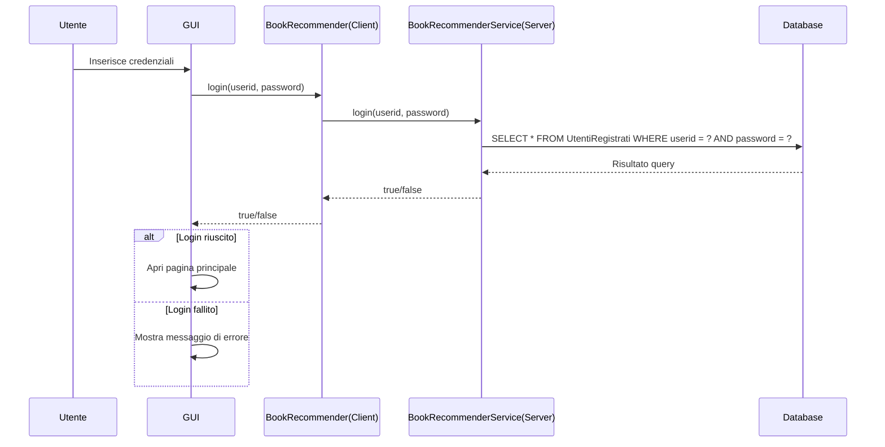
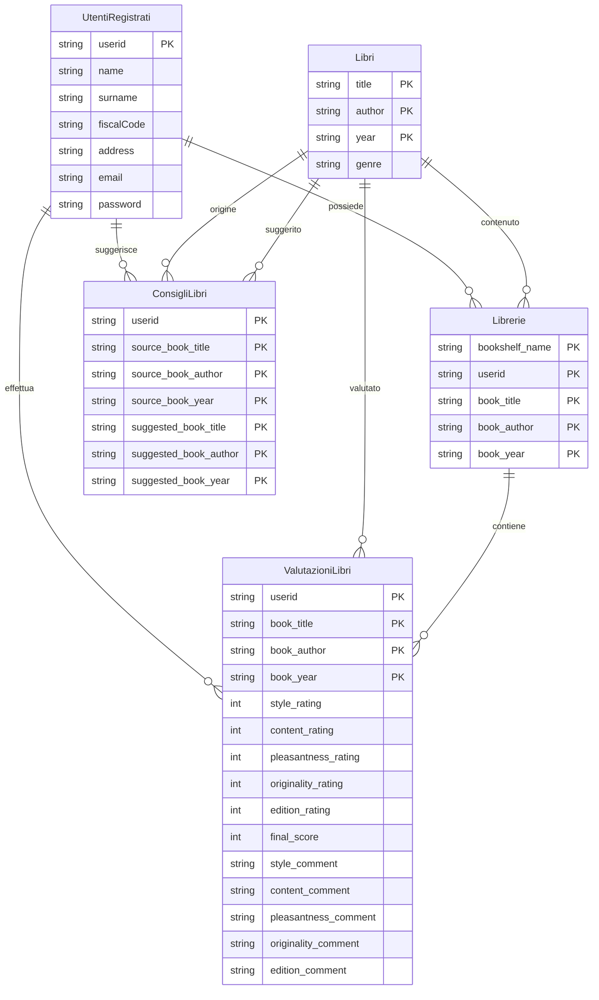

**Nota bene**: i diagrammi sono scritti in linguaggio [Mermaid](https://mermaid.js.org/).  
Per la corretta visualizzazione si consiglia di aprire questo file direttamente su GitHub.

## Diagramma delle classi

```mermaid
classDiagram
    class User {
        -String Name
        -String Surname
        -String FiscalCode
        -String Address
        -String Email
        -String Userid
        -String Password
        +User()
        +User(String Name, String Surname, String FiscalCode, String Address, String Email, String Userid, String Password)
        +getName() String
        +getSurname() String
        +getFiscalCode() String
        +getAddress() String
        +getEmail() String
        +getUserid() String
        +getPassword() String
    }

    class Book {
        -String Title
        -String Author
        -String Year
        -String Genre
        +Book()
        +Book(String Title, String Author, String Year, String Genre)
        +getTitle() String
        +getAuthor() String
        +getGenre() String
        +getYear() String
    }

    class Bookshelf {
        -String Name
        -String Userid
        -ArrayList~String~ Books
        +Bookshelf()
        +Bookshelf(String Name, String Userid, ArrayList~String~ Books)
        +getName() String
        +getUserid() String
        +getBooks() ArrayList~String~
    }

    class Rating {
        -String BookshelfName
        -String userid
        -String Book
        -int Stile
        -int Contenuto
        -int Gradevolezza
        -int Originalita
        -int Edizione
        -int VotoFinale
        -String styleComment
        -String contentComment
        -String pleasantnessComment
        -String originalityComment
        -String editionComment
        +Rating(String BookshelfName, String userid, String Book, int stile, int contenuto, int gradevolezza, int originalita, int edizione, int votofinale, String styleComment, String contentComment, String pleasantnessComment, String originalityComment, String editionComment)
        +getBookshelf() String
        +getUserid() String
        +getBook() String
        +getStile() int
        +getContenuto() int
        +getGradevolezza() int
        +getOriginalita() int
        +getEdizione() int
        +getVotoFinale() int
        +getStyleComment() String
        +getContentComment() String
        +getPleasantnessComment() String
        +getOriginalityComment() String
        +getEditionComment() String
        +setStyleComment(String styleComment)
        +setContentComment(String contentComment)
        +setPleasantnessComment(String pleasantnessComment)
        +setOriginalityComment(String originalityComment)
        +setEditionComment(String editionComment)
    }

    class RecommendedBook {
        -String title
        -int count
        +RecommendedBook(String title, int count)
        +getTitle() String
        +getCount() int
        +setTitle(String title)
        +setCount(int count)
    }

    class UserComment {
        -String userId
        -String comment
        +UserComment(String userId, String comment)
        +getUserId() String
        +getComment() String
    }

    class BookRecommender {
        -IBookRecommenderService service
        +main(String[] args)
        +login(String userid, String password) boolean
        +useridExist(String text) boolean
        +createUser(String name, String surname, String fiscalCode, String address, String mail, String userid, String password)
        +cercaLibro(String criterio, String valore1, String valore2, String bookshelf, String user) ArrayList~Book~
        +getBooks() DefaultComboBoxModel~Book~
        +searchBookshelf(String bookshelfName, String userid) boolean
        +appendBookshelf(String bookshelfName, String userid, ArrayList~Book~ bookshelfBooks)
        +getBookshelves(String userid) HashMap~Bookshelf_key, Bookshelf~
        +getBookshelfBooks(String bookshelfName, String userid) ArrayList~String~
        +appendRating(String userid, String bookshelf, String bookTitle, String bookAuthor, String bookYear, int style, int content, int pleasantness, int originality, int edition, int finalScore, String styleComment, String contentComment, String pleasantnessComment, String originalityComment, String editionComment) boolean
        +getRatingValue(String title, String criterion) int
        +getRatingValue(String userid, String title, String criterion) int
        +insertSuggestion(String userid, String sourceBookTitle, String sourceBookAuthor, String sourceBookYear, ArrayList~Book~ suggestedBooks) boolean
        +getSuggestedBooksWithCount(String title) ArrayList~RecommendedBook~
        +getSuggestedBooks(String title) ArrayList~String~
        +getAggregatedRating(String title) AggregatedRating
        +getUserComments(String title) ArrayList~UserComment~
        +addCriterionCommentToBook(String userid, String bookTitle, String criterion, String comment) boolean
        +getBookByTitle(String title) Book
    }

    class IBookRecommenderService {
        <<Interface>>
        +login(String userid, String password) boolean
        +useridExist(String text) boolean
        +createUser(String name, String surname, String fiscalCode, String address, String mail, String userid, String password)
        +cercaLibro(String criterio, String valore1, String valore2, String bookshelf, String user) ArrayList~Book~
        +getBooks() DefaultComboBoxModel~Book~
        +searchBookshelf(String bookshelfName, String userid) boolean
        +appendBookshelf(String bookshelfName, String userid, ArrayList~Book~ bookshelfBooks)
        +getBookshelves(String userid) HashMap~Bookshelf_key, Bookshelf~
        +getBookshelfBooks(String bookshelfName, String userid) ArrayList~String~
        +appendRating(String userid, String bookshelf, String bookTitle, String bookAuthor, String bookYear, int style, int content, int pleasantness, int originality, int edition, int finalScore, String styleComment, String contentComment, String pleasantnessComment, String originalityComment, String editionComment) boolean
        +getRatingValue(String title, String criterion) int
        +getRatingValue(String userid, String title, String criterion) int
        +insertSuggestion(String userid, String sourceBookTitle, String sourceBookAuthor, String sourceBookYear, ArrayList~Book~ suggestedBooks) boolean
        +getSuggestedBooksWithCount(String title) ArrayList~RecommendedBook~
        +getSuggestedBooks(String title) ArrayList~String~
        +getAggregatedRating(String title) AggregatedRating
        +getUserComments(String title) ArrayList~UserComment~
        +addCriterionCommentToBook(String userid, String bookTitle, String criterion, String comment) boolean
        +getBookByTitle(String title) Book
    }

    User "1" -- "0..*" Bookshelf : owns
    User "1" -- "0..*" Rating : provides
    User "1" -- "0..*" UserComment : writes
    Book "1" -- "0..*" Bookshelf : contained in
    Book "1" -- "0..*" Rating : rated
    Book "1" -- "0..*" RecommendedBook : recommended
    Book "1" -- "0..*" UserComment : commented
    Bookshelf "1" -- "0..*" Book : contains
    Rating "1" -- "1" Book : rates
    Rating "1" -- "1" User : by
    RecommendedBook "1" -- "1" Book : recommendation for
    UserComment "1" -- "1" Book : on
    UserComment "1" -- "1" User : by
    BookRecommender ..|> IBookRecommenderService : implements

```

## Diagramma di sequenza

## Diagramma ER

