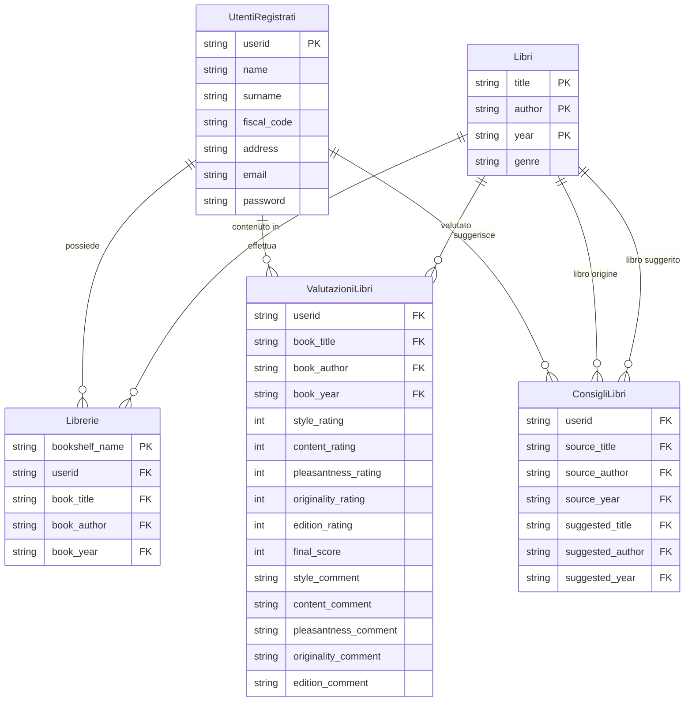
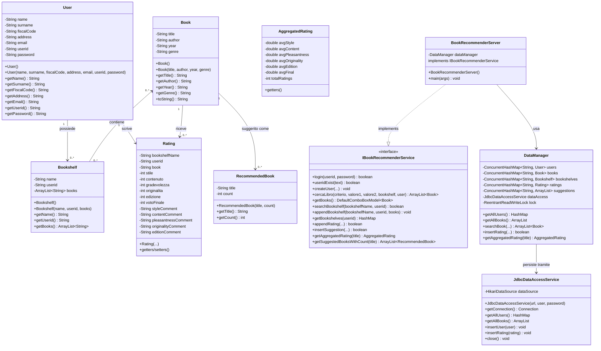
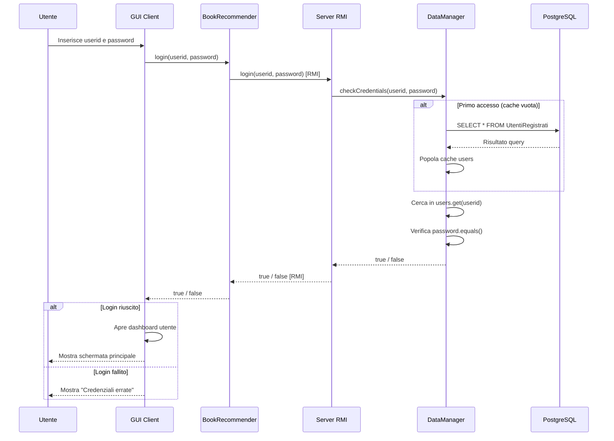
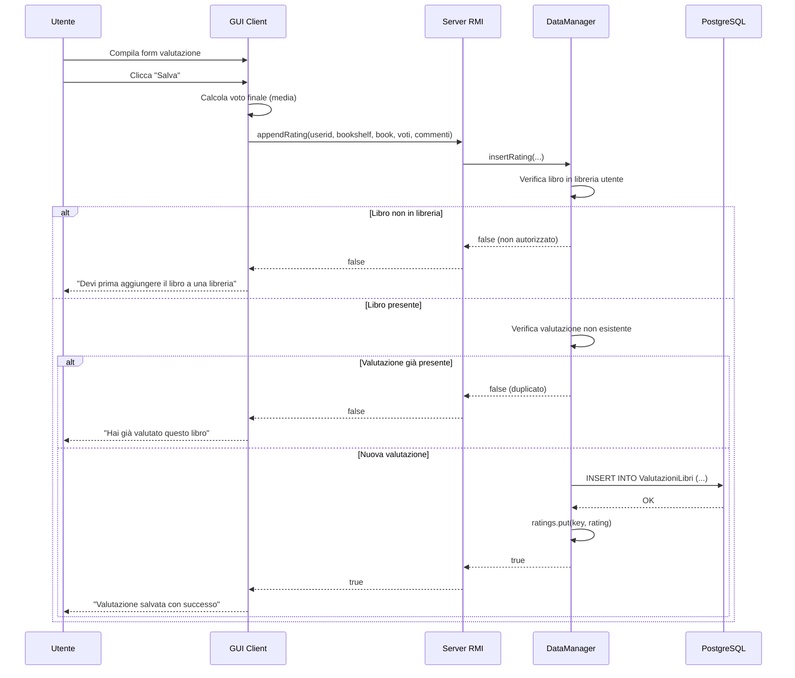

# Manuale Tecnico - Book Recommender

**Corso:** Laboratorio Interdisciplinare B  
**Università degli Studi dell'Insubria** – A.A. 2024/2025  
**Autori:** Matteo Mantica (Mat. 758070, VA), Leonardo Lambruschi (Mat. 753579, VA)  
**Versione:** 1.0.0 – Gennaio 2026

---

## Sommario

1. [Introduzione](#1-introduzione)
2. [Architettura del Sistema](#2-architettura-del-sistema)
3. [Progettazione del Database](#3-progettazione-del-database)
4. [Progettazione del Software](#4-progettazione-del-software)
5. [Algoritmi e Strutture Dati](#5-algoritmi-e-strutture-dati)
6. [Gestione della Concorrenza](#6-gestione-della-concorrenza)
7. [API e Interfacce](#7-api-e-interfacce)
8. [Installazione e Deployment](#8-installazione-e-deployment)
9. [Troubleshooting](#9-troubleshooting)

---

## 1. Introduzione

### 1.1 Scopo del Documento

Questo manuale tecnico descrive in dettaglio l'architettura, le scelte progettuali e le implementazioni del sistema Book Recommender. Il documento è rivolto a sviluppatori che desiderano comprendere il funzionamento interno del sistema, estenderne le funzionalità o effettuare manutenzione.

### 1.2 Panoramica del Sistema

Book Recommender è un'applicazione distribuita per la gestione e la raccomandazione di libri. Il sistema consente agli utenti di:

- **Consultare** un catalogo di libri con funzionalità di ricerca avanzata
- **Registrarsi** e autenticarsi per accedere a funzionalità personalizzate
- **Creare librerie personali** per organizzare le proprie letture
- **Valutare libri** secondo cinque criteri distinti più un voto complessivo
- **Suggerire libri correlati** per arricchire il sistema di raccomandazioni
- **Visualizzare statistiche aggregate** delle valutazioni della community

### 1.3 Tecnologie Utilizzate

| Componente | Tecnologia | Motivazione |
|------------|------------|-------------|
| Linguaggio | Java 8+ | Portabilità, robustezza, supporto RMI nativo |
| Comunicazione | Java RMI | Semplicità per architetture distribuite Java |
| Database | PostgreSQL | Open source, affidabile, supporto transazionale |
| Connection Pool | HikariCP | Prestazioni elevate, configurazione minima |
| GUI | Java Swing | Integrazione nativa, nessuna dipendenza esterna |
| Build System | Apache Maven | Standard de facto, gestione dipendenze automatica |

---

## 2. Architettura del Sistema

### 2.1 Architettura Complessiva

Il sistema adotta un'architettura client-server a tre livelli (three-tier), dove ogni livello ha responsabilità ben definite:

```
┌─────────────────────────────────────────────────────────────────────────┐
│                         PRESENTATION TIER                                │
│  ┌─────────────┐  ┌─────────────┐  ┌─────────────┐                      │
│  │  Client 1   │  │  Client 2   │  │  Client N   │   (Java Swing GUI)   │
│  └──────┬──────┘  └──────┬──────┘  └──────┬──────┘                      │
└─────────┼────────────────┼────────────────┼─────────────────────────────┘
          │                │                │
          │           Java RMI              │
          │                │                │
┌─────────┼────────────────┼────────────────┼─────────────────────────────┐
│         ▼                ▼                ▼          BUSINESS TIER       │
│  ┌─────────────────────────────────────────────────┐                     │
│  │           BookRecommenderServer                  │                     │
│  │  ┌───────────────────────────────────────────┐  │                     │
│  │  │              DataManager                   │  │                     │
│  │  │   (Logica di business + Concorrenza)       │  │                     │
│  │  └───────────────────────────────────────────┘  │                     │
│  └──────────────────────┬──────────────────────────┘                     │
└─────────────────────────┼───────────────────────────────────────────────┘
                          │
                      JDBC + HikariCP
                          │
┌─────────────────────────┼───────────────────────────────────────────────┐
│                         ▼                          DATA TIER             │
│  ┌─────────────────────────────────────────────────┐                     │
│  │                 PostgreSQL                       │                     │
│  │   (Libri, Utenti, Librerie, Valutazioni, ...)   │                     │
│  └─────────────────────────────────────────────────┘                     │
└─────────────────────────────────────────────────────────────────────────┘
```

### 2.2 Componenti e Responsabilità

#### Client (clientBR)
Il modulo client gestisce l'interfaccia utente e la comunicazione con il server. Non contiene logica di business: ogni operazione viene delegata al server tramite chiamate RMI. Questo approccio garantisce che i dati siano sempre consistenti e centralizzati.

#### Server (serverBR)
Il server espone i servizi attraverso l'interfaccia RMI e orchestra tutte le operazioni. La classe `BookRecommenderServer` implementa l'interfaccia remota, mentre `DataManager` gestisce la logica applicativa e coordina l'accesso ai dati.

#### DataManager
Rappresenta il cuore del sistema. Mantiene una cache in memoria delle entità principali (utenti, libri, librerie) e sincronizza ogni modifica con il database. Utilizza strutture dati thread-safe per supportare accessi concorrenti.

#### JdbcDataAccessService
Fornisce l'astrazione del layer di persistenza. Tutte le operazioni SQL sono centralizzate in questa classe, facilitando eventuali migrazioni a database diversi.

### 2.3 Flusso di una Richiesta Tipica

Quando un utente effettua un'operazione, ad esempio la valutazione di un libro, il flusso è il seguente:

1. L'utente interagisce con la GUI compilando i campi di valutazione
2. Il client invoca il metodo RMI `appendRating()` sul server
3. Il server delega a `DataManager` la validazione e l'inserimento
4. `DataManager` aggiorna prima il database tramite `JdbcDataAccessService`
5. Se la scrittura su DB ha successo, aggiorna anche la cache in memoria
6. Il risultato viene restituito al client che aggiorna l'interfaccia

Questo approccio "database-first" garantisce che non ci siano mai inconsistenze tra memoria e storage persistente.

---

## 3. Progettazione del Database

### 3.1 Analisi dei Requisiti

Partendo dalle specifiche, abbiamo identificato le seguenti entità principali:

- **Utenti**: persone registrate che possono creare librerie, valutare e suggerire libri
- **Libri**: il catalogo centrale, identificato dalla tripletta (titolo, autore, anno)
- **Librerie**: raccolte personali di libri, create dagli utenti registrati
- **Valutazioni**: giudizi multidimensionali espressi dagli utenti sui libri
- **Suggerimenti**: associazioni tra libri correlati, proposte dagli utenti

### 3.2 Schema Concettuale (Diagramma ER)

Il seguente diagramma Entity-Relationship rappresenta la struttura concettuale del database:



### 3.3 Vincoli di Integrità

Oltre ai vincoli definiti dallo schema, il sistema impone le seguenti regole:

| Vincolo | Descrizione | Implementazione |
|---------|-------------|-----------------|
| Unicità userid | Ogni utente deve avere un identificativo univoco | Chiave primaria + check applicativo |
| Valutazione unica | Un utente può valutare un libro una sola volta | Chiave primaria composita |
| Voto finale calcolato | Il voto finale è la media arrotondata dei 5 criteri | Calcolato lato applicativo |
| Max 3 suggerimenti | Ogni utente può suggerire al massimo 3 libri per ogni libro | Check applicativo |
| Libri dalla libreria | Si possono valutare/suggerire solo libri nelle proprie librerie | Check applicativo |
| Commenti opzionali | I commenti per ogni criterio sono facoltativi (max 256 char) | Nullable + VARCHAR(256) |

### 3.4 Schema Relazionale

Lo schema concettuale è stato tradotto nel seguente schema relazionale:

```sql
CREATE TABLE UtentiRegistrati (
    userid VARCHAR(50) PRIMARY KEY,
    name VARCHAR(100) NOT NULL,
    surname VARCHAR(100) NOT NULL,
    fiscal_code VARCHAR(16) NOT NULL,
    address VARCHAR(255),
    email VARCHAR(100) NOT NULL,
    password VARCHAR(100) NOT NULL
);

CREATE TABLE Libri (
    title VARCHAR(255),
    author VARCHAR(255),
    year VARCHAR(10),
    genre VARCHAR(100),
    PRIMARY KEY (title, author, year)
);

CREATE TABLE Librerie (
    bookshelf_name VARCHAR(100),
    userid VARCHAR(50) REFERENCES UtentiRegistrati(userid),
    book_title VARCHAR(255),
    book_author VARCHAR(255),
    book_year VARCHAR(10),
    PRIMARY KEY (bookshelf_name, userid, book_title, book_author, book_year),
    FOREIGN KEY (book_title, book_author, book_year) REFERENCES Libri(title, author, year)
);

CREATE TABLE ValutazioniLibri (
    userid VARCHAR(50) REFERENCES UtentiRegistrati(userid),
    book_title VARCHAR(255),
    book_author VARCHAR(255),
    book_year VARCHAR(10),
    style_rating INT CHECK (style_rating BETWEEN 1 AND 5),
    content_rating INT CHECK (content_rating BETWEEN 1 AND 5),
    pleasantness_rating INT CHECK (pleasantness_rating BETWEEN 1 AND 5),
    originality_rating INT CHECK (originality_rating BETWEEN 1 AND 5),
    edition_rating INT CHECK (edition_rating BETWEEN 1 AND 5),
    final_score INT CHECK (final_score BETWEEN 1 AND 5),
    style_comment VARCHAR(256),
    content_comment VARCHAR(256),
    pleasantness_comment VARCHAR(256),
    originality_comment VARCHAR(256),
    edition_comment VARCHAR(256),
    PRIMARY KEY (userid, book_title, book_author, book_year),
    FOREIGN KEY (book_title, book_author, book_year) REFERENCES Libri(title, author, year)
);

CREATE TABLE ConsigliLibri (
    userid VARCHAR(50) REFERENCES UtentiRegistrati(userid),
    source_title VARCHAR(255),
    source_author VARCHAR(255),
    source_year VARCHAR(10),
    suggested_title VARCHAR(255),
    suggested_author VARCHAR(255),
    suggested_year VARCHAR(10),
    PRIMARY KEY (userid, source_title, source_author, source_year, 
                 suggested_title, suggested_author, suggested_year),
    FOREIGN KEY (source_title, source_author, source_year) 
        REFERENCES Libri(title, author, year),
    FOREIGN KEY (suggested_title, suggested_author, suggested_year) 
        REFERENCES Libri(title, author, year)
);
```

---

## 4. Progettazione del Software

### 4.1 Diagramma delle Classi

Il seguente diagramma UML mostra le classi principali del sistema e le loro relazioni:



### 4.2 Pattern Architetturali Utilizzati

#### Data Access Object (DAO)
La classe `JdbcDataAccessService` implementa il pattern DAO, separando la logica di accesso ai dati dalla logica di business. Questo consente di modificare il layer di persistenza (ad esempio, passando da PostgreSQL a MySQL) senza impattare il resto dell'applicazione.

#### Facade
`DataManager` agisce come facade verso il client, nascondendo la complessità delle operazioni interne. Il client non ha bisogno di conoscere i dettagli dell'implementazione: invoca semplicemente i metodi esposti.

#### Singleton
Il server RMI e il DataManager vengono istanziati una sola volta durante l'avvio dell'applicazione, garantendo un punto di accesso centralizzato ai dati.

### 4.3 Diagramma di Sequenza - Autenticazione

Il seguente diagramma illustra il flusso di autenticazione di un utente:



### 4.4 Diagramma di Sequenza - Inserimento Valutazione



---

## 5. Algoritmi e Strutture Dati

### 5.1 Strutture Dati Principali

Il sistema utilizza `ConcurrentHashMap` come struttura dati principale per tutte le entità. Questa scelta è motivata da:

- **Complessità O(1)** per operazioni di lookup, inserimento e rimozione
- **Thread-safety nativa** senza necessità di sincronizzazione esplicita
- **Alta concorrenza** grazie alla segmentazione interna della struttura

```
┌────────────────────────────────────────────────────────────────┐
│                        DataManager                              │
├────────────────────────────────────────────────────────────────┤
│  ConcurrentHashMap<String, User>        users       → O(1)     │
│  ConcurrentHashMap<Book_key, Book>      books       → O(1)     │
│  ConcurrentHashMap<Bookshelf_key, Bookshelf> bookshelves → O(1)│
│  ConcurrentHashMap<Rating_key, Rating>  ratings     → O(1)     │
│  ConcurrentHashMap<String, ArrayList>   suggestions → O(1)     │
└────────────────────────────────────────────────────────────────┘
```

### 5.2 Algoritmo di Ricerca Libri

La ricerca dei libri supporta tre modalità: per titolo, per autore, e per autore+anno. L'algoritmo effettua una scansione lineare del catalogo applicando filtri case-insensitive con supporto per sottostringhe.

```
ALGORITMO: cercaLibro(criterio, valore1, valore2)
──────────────────────────────────────────────────
INPUT:  criterio ∈ {"titolo", "autore", "autoreanno"}
        valore1: stringa di ricerca principale
        valore2: anno (solo per ricerca autore+anno)
OUTPUT: lista di libri che soddisfano i criteri

risultati ← lista vuota
valore1_lower ← toLowerCase(valore1)

PER OGNI libro IN catalogo:
    CASO criterio:
        "titolo":
            SE toLowerCase(libro.titolo) CONTIENE valore1_lower:
                aggiungi libro a risultati
        
        "autore":
            SE toLowerCase(libro.autore) CONTIENE valore1_lower:
                aggiungi libro a risultati
        
        "autoreanno":
            SE toLowerCase(libro.autore) CONTIENE valore1_lower
               E libro.anno == valore2:
                aggiungi libro a risultati

RITORNA risultati
──────────────────────────────────────────────────
Complessità temporale: O(n) dove n = numero di libri
Complessità spaziale: O(r) dove r = risultati trovati
```

### 5.3 Algoritmo di Calcolo Valutazioni Aggregate

Quando un utente visualizza un libro, il sistema calcola le statistiche aggregate di tutte le valutazioni ricevute:

```
ALGORITMO: calcolaValutazioniAggregate(titolo_libro)
────────────────────────────────────────────────────
INPUT:  titolo del libro
OUTPUT: oggetto AggregatedRating con medie e conteggi

somma_stile ← 0, somma_contenuto ← 0, ...
conteggio ← 0

PER OGNI valutazione IN ratings:
    SE valutazione.libro == titolo_libro:
        somma_stile += valutazione.stile
        somma_contenuto += valutazione.contenuto
        somma_gradevolezza += valutazione.gradevolezza
        somma_originalita += valutazione.originalita
        somma_edizione += valutazione.edizione
        conteggio += 1

SE conteggio > 0:
    media_stile ← somma_stile / conteggio
    media_contenuto ← somma_contenuto / conteggio
    ... (per ogni criterio)
    media_finale ← (media_stile + media_contenuto + ... ) / 5
ALTRIMENTI:
    RITORNA "Nessuna valutazione disponibile"

RITORNA AggregatedRating(medie, conteggio)
────────────────────────────────────────────────────
Complessità temporale: O(m) dove m = numero totale di valutazioni
Complessità spaziale: O(1)
```

### 5.4 Algoritmo di Conteggio Suggerimenti

Per ogni libro, il sistema conta quanti utenti hanno suggerito ciascun libro correlato:

```
ALGORITMO: getSuggestedBooksWithCount(titolo_libro)
───────────────────────────────────────────────────
INPUT:  titolo del libro origine
OUTPUT: lista di (libro_suggerito, conteggio) ordinata per popolarità

conteggi ← HashMap vuota

PER OGNI suggerimento IN suggestions:
    SE suggerimento.libro_origine == titolo_libro:
        libro_sugg ← suggerimento.libro_suggerito
        SE libro_sugg IN conteggi:
            conteggi[libro_sugg] += 1
        ALTRIMENTI:
            conteggi[libro_sugg] ← 1

risultati ← converti conteggi in lista di RecommendedBook
ordina risultati per conteggio decrescente

RITORNA risultati
───────────────────────────────────────────────────
Complessità temporale: O(s + s·log(s)) dove s = suggerimenti per il libro
Complessità spaziale: O(s)
```

### 5.5 Tabella Riassuntiva delle Complessità

| Operazione | Tempo | Spazio | Note |
|------------|-------|--------|------|
| Login / verifica credenziali | O(1) | O(1) | Lookup diretto in HashMap |
| Ricerca libri | O(n) | O(r) | n = catalogo, r = risultati |
| Creazione utente | O(1) + DB | O(1) | Insert in HashMap + DB |
| Creazione libreria | O(p) + DB | O(p) | p = libri nella libreria |
| Inserimento valutazione | O(1) + DB | O(1) | Verifica duplicati O(1) |
| Valutazioni aggregate | O(m) | O(1) | m = tutte le valutazioni |
| Suggerimenti con conteggio | O(s·log s) | O(s) | s = suggerimenti |
| Verifica esistenza libreria | O(1) | O(1) | Chiave composta |

---

## 6. Gestione della Concorrenza

### 6.1 Problema della Concorrenza

In un sistema distribuito con più client connessi simultaneamente, operazioni concorrenti possono causare:

- **Race condition**: due utenti che modificano lo stesso dato contemporaneamente
- **Inconsistenze memoria-database**: aggiornamenti parziali in caso di errori
- **Starvation**: operazioni che non vengono mai completate

### 6.2 Soluzioni Implementate

#### ConcurrentHashMap
Tutte le strutture dati principali utilizzano `ConcurrentHashMap`, che garantisce:
- Operazioni atomiche per lettura e scrittura singole
- Nessun blocco globale: più thread possono operare su segmenti diversi
- Metodi atomici come `putIfAbsent()` e `computeIfAbsent()`

#### ReentrantReadWriteLock
Per operazioni complesse che richiedono coerenza tra più strutture dati, utilizziamo lock espliciti:

```java
private final ReentrantReadWriteLock lock = new ReentrantReadWriteLock();

public void operazioneComplessa() {
    lock.writeLock().lock();
    try {
        // Modifica atomica di più strutture
    } finally {
        lock.writeLock().unlock();
    }
}
```

#### Strategia Database-First
Ogni operazione di scrittura segue questo pattern:

1. Acquisizione del lock (se necessario)
2. Scrittura sul database
3. Se la scrittura DB ha successo → aggiornamento memoria
4. Se la scrittura DB fallisce → nessuna modifica in memoria
5. Rilascio del lock

Questo garantisce che la memoria sia sempre allineata con il database.

### 6.3 Connection Pooling con HikariCP

HikariCP gestisce un pool di connessioni al database, eliminando l'overhead di creazione/distruzione di connessioni per ogni richiesta:

```java
HikariConfig config = new HikariConfig();
config.setJdbcUrl("jdbc:postgresql://host:5432/db");
config.setUsername("user");
config.setPassword("password");
config.setMaximumPoolSize(10);  // Max 10 connessioni simultanee
config.setMinimumIdle(2);       // Minimo 2 connessioni sempre pronte
```

---

## 7. API e Interfacce

### 7.1 Interfaccia IBookRecommenderService

L'interfaccia RMI espone tutti i metodi accessibili dai client:

| Metodo | Parametri | Ritorno | Descrizione |
|--------|-----------|---------|-------------|
| `login` | userid, password | boolean | Autentica l'utente |
| `useridExist` | userid | boolean | Verifica se userid è già in uso |
| `createUser` | name, surname, fiscalCode, address, email, userid, password | void | Registra nuovo utente |
| `cercaLibro` | criterio, valore1, valore2, bookshelf, user | ArrayList<Book> | Ricerca libri |
| `getBooks` | - | DefaultComboBoxModel<Book> | Tutti i libri per combo box |
| `searchBookshelf` | bookshelfName, userid | boolean | Verifica esistenza libreria |
| `appendBookshelf` | bookshelfName, userid, books | void | Crea nuova libreria |
| `getBookshelves` | userid | HashMap | Tutte le librerie dell'utente |
| `getBookshelfBooks` | bookshelfName, userid | ArrayList<String> | Libri in una libreria |
| `appendRating` | userid, bookshelf, book..., voti..., commenti... | boolean | Inserisce valutazione |
| `getRatingValue` | title, criterion | int | Voto aggregato per criterio |
| `insertSuggestion` | userid, sourceBook, suggestedBooks | boolean | Inserisce suggerimenti |
| `getSuggestedBooksWithCount` | title | ArrayList<RecommendedBook> | Suggerimenti con conteggio |
| `getAggregatedRating` | title | AggregatedRating | Valutazioni aggregate |
| `getUserComments` | title | ArrayList<UserComment> | Tutti i commenti per un libro |

### 7.2 Modelli di Dati

#### Book
```java
public class Book implements Serializable {
    private String title;   // Titolo del libro
    private String author;  // Autore
    private String year;    // Anno di pubblicazione
    private String genre;   // Genere letterario
}
```

#### User
```java
public class User implements Serializable {
    private String name;        // Nome
    private String surname;     // Cognome
    private String fiscalCode;  // Codice fiscale
    private String address;     // Indirizzo
    private String email;       // Email
    private String userid;      // Identificativo univoco
    private String password;    // Password
}
```

#### AggregatedRating
```java
public class AggregatedRating implements Serializable {
    private double avgStyle;        // Media voto stile
    private double avgContent;      // Media voto contenuto
    private double avgPleasantness; // Media voto gradevolezza
    private double avgOriginality;  // Media voto originalità
    private double avgEdition;      // Media voto edizione
    private double avgFinal;        // Media voto finale
    private int totalRatings;       // Numero totale valutazioni
}
```

---

## 8. Installazione e Deployment

### 8.1 Requisiti di Sistema

| Requisito | Versione Minima | Consigliata |
|-----------|-----------------|-------------|
| Java JDK | 8 | 11 o superiore |
| PostgreSQL | 9.x | 14 o superiore |
| RAM | 512 MB | 2 GB |
| Spazio disco | 100 MB | 500 MB |
| Rete | Connessione stabile per RMI ||

### 8.2 Compilazione

```bash
# Clona il repository
git clone https://github.com/lambrooo/LaboratorioB
cd LaboratorioB

# Compila con Maven
mvn clean install
```

### 8.3 Setup del Database

```bash
# Crea il database
psql -U postgres -c "CREATE DATABASE bookrecommender_db;"

# Esegui lo schema
mvn install -Psetup-db \
    -Ddb.username=postgres \
    -Ddb.name=bookrecommender_db \
    -Ddb.password=password

# Popola il catalogo libri
psql -U postgres -d bookrecommender_db -f db/populate_books.sql
```

### 8.4 Avvio dei Componenti

```bash
# Terminale 1: Avvio Server
java -jar serverBR/target/serverBR-1.0-SNAPSHOT.jar

# Terminale 2: Avvio Client
java -jar clientBR/target/clientBR-1.0-SNAPSHOT.jar
```

Il server richiederà i parametri di connessione al database. Una volta avviato, accetta connessioni sulla porta RMI 1099.

---

## 9. Troubleshooting

### 9.1 Problemi Comuni

| Problema | Causa Probabile | Soluzione |
|----------|-----------------|-----------|
| Connection refused | Server non avviato | Verificare che il server sia in esecuzione |
| SQLException | Credenziali DB errate | Controllare username, password e nome database |
| ClassNotFoundException | JAR incompleto | Ricompilare con `mvn clean install` |
| Port already in use | Porta 1099 occupata | Terminare processi RMI esistenti |
| RMI timeout | Firewall | Aprire porta 1099 e porte dinamiche RMI |

### 9.2 Log di Debug

Per abilitare log dettagliati:

```bash
java -Djava.rmi.server.logCalls=true \
     -Dorg.slf4j.simpleLogger.defaultLogLevel=debug \
     -jar serverBR-1.0-SNAPSHOT.jar
```

### 9.3 Verifica Connessione Database

```bash
# Test connessione PostgreSQL
psql -h localhost -p 5432 -U username -d bookrecommender_db -c "SELECT 1;"
```

---

**Fine del Manuale Tecnico**

© 2026 Matteo Mantica, Leonardo Lambruschi, Giulia Vanzini  
Università degli Studi dell'Insubria – Laboratorio Interdisciplinare B