# MANUALE UTENTE - Book Recommender System

## Sommario
1. [Introduzione](#1-introduzione)
2. [Installazione](#2-installazione)
3. [Avvio del Programma](#3-avvio-del-programma)
4. [Accesso al Sistema](#4-accesso-al-sistema)
5. [Ricerca Libri](#5-ricerca-libri)
6. [Gestione Librerie](#6-gestione-librerie)
7. [Valutazione Libri](#7-valutazione-libri)
8. [Sistema di Suggerimenti](#8-sistema-di-suggerimenti)
9. [FAQ e Risoluzione Problemi](#9-faq-e-risoluzione-problemi)

## 1. Introduzione

Benvenuto nel Book Recommender System!

Questa applicazione permette di:
- Cercare libri nel catalogo
- Creare librerie personalizzate
- Valutare libri con criteri dettagliati
- Suggerire libri correlati
- Condividere recensioni e commenti

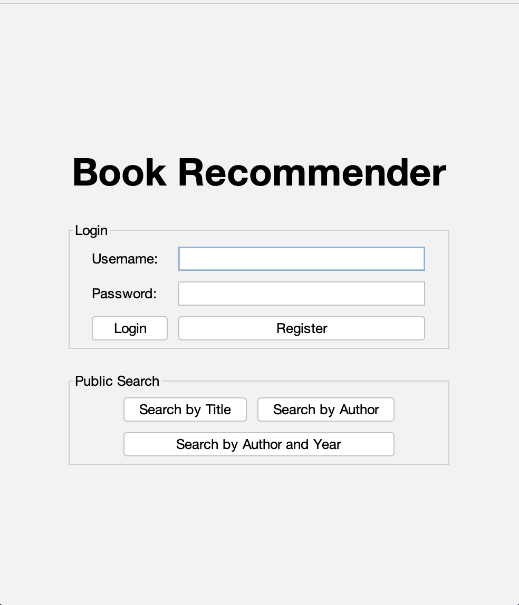

## 2. Installazione

### 2.1 Requisiti di Sistema
- Sistema Operativo: Windows, macOS, Linux (qualsiasi sistema che supporta Java)
- Java Runtime Environment (JRE): Versione 8 o superiore
- Connessione Internet: Per la comunicazione tra client e server
- Database PostgreSQL: Deve essere installato e configurato separatamente

### 2.2 Installazione del Programma
1. Scaricare e decomprimere il pacchetto dell'applicazione
2. Verificare che i file `serverBR-1.0-SNAPSHOT.jar` e `clientBR-1.0-SNAPSHOT.jar` siano presenti nella cartella `bin`
3. Installare e configurare PostgreSQL seguendo le istruzioni del proprio sistema operativo

## 3. Avvio del Programma

### 3.1 Avvio del Server
1. Aprire un terminale o prompt dei comandi
2. Navigare alla cartella principale dell'applicazione
3. Eseguire il server con il seguente comando:
   ```
   java -jar bin/serverBR-1.0-SNAPSHOT.jar
   ```
   
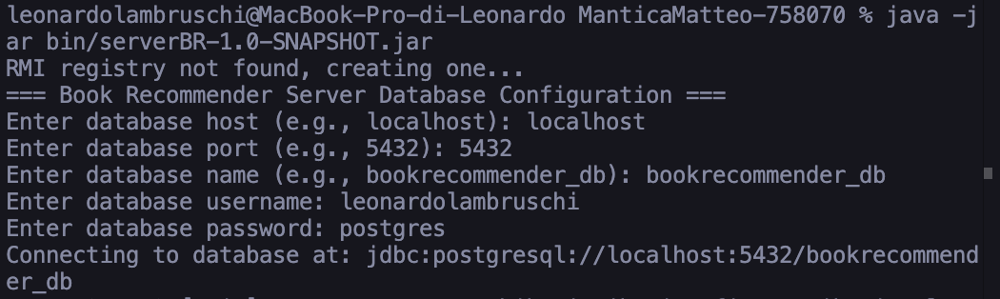

4. Il server richiederà le credenziali del database:
   - Host: Indirizzo del server PostgreSQL (es. `localhost`)
   - Porta: Porta del server PostgreSQL (es. `5432`)
   - Nome Database: Nome del database creato (es. `bookrecommender_db`)
   - Username: Nome utente del database
   - Password: Password del database

5. Una volta inserite le credenziali, il server sarà pronto e in attesa di connessioni

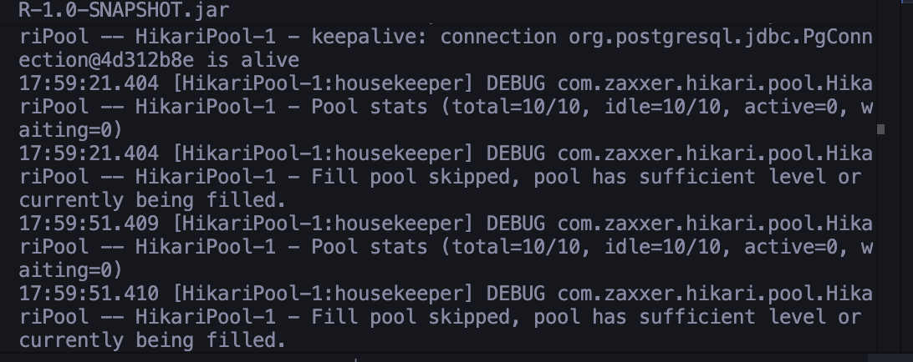

### 3.2 Avvio del Client
1. Aprire un nuovo terminale o prompt dei comandi (lasciando il server in esecuzione)
2. Navigare alla cartella principale dell'applicazione
3. Eseguire il client con il seguente comando:
   ```
   java -jar bin/clientBR-1.0-SNAPSHOT.jar
   ```
4. Il client richiederà l'indirizzo del server (es. `localhost` per esecuzione locale)
5. Si aprirà l'interfaccia grafica dell'applicazione

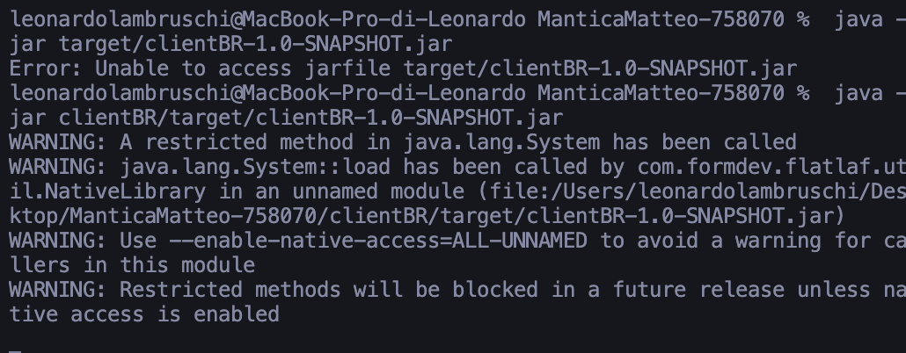

## 4. Accesso al Sistema

### 4.1 Registrazione Nuovo Utente
1. Cliccare sul pulsante "Registrati"
2. Compilare tutti i campi obbligatori:
   - Nome e Cognome
   - Codice Fiscale
   - Indirizzo
   - Email
   - User ID (nome utente univoco)
   - Password (almeno 8 caratteri)
3. Cliccare "Conferma Registrazione"

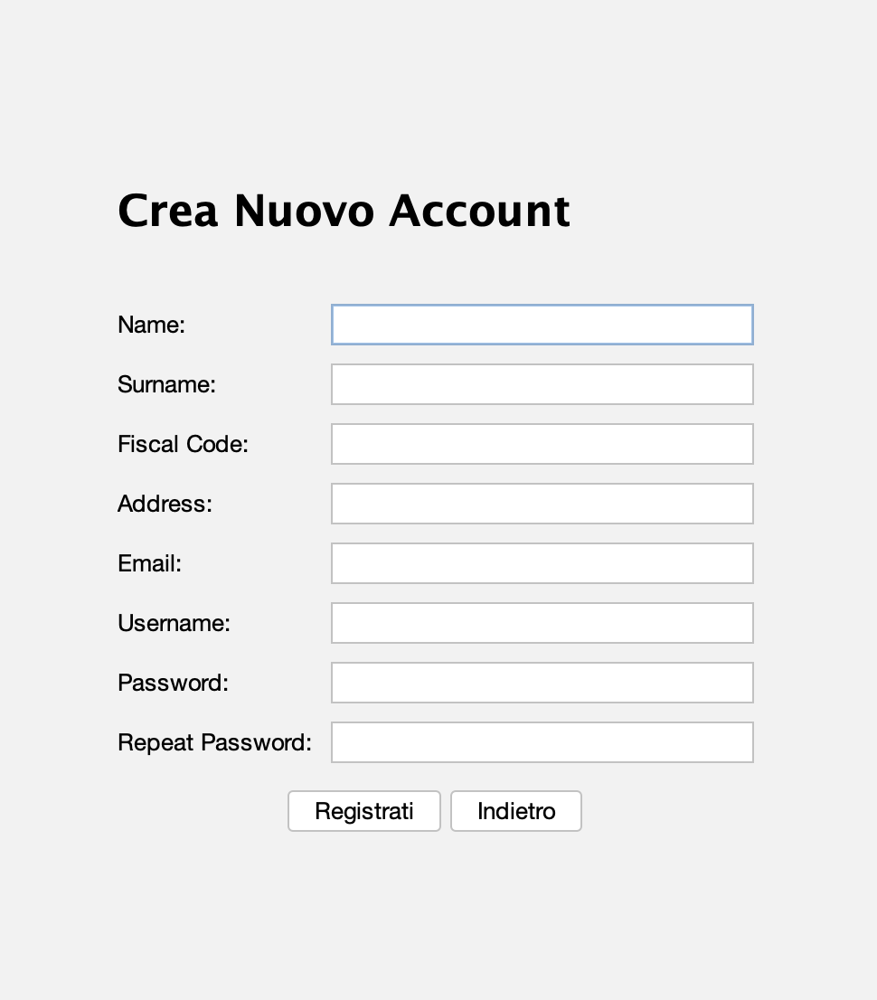

### 4.2 Login
1. Inserire il proprio User ID
2. Inserire la propria Password
3. Cliccare "Accedi"

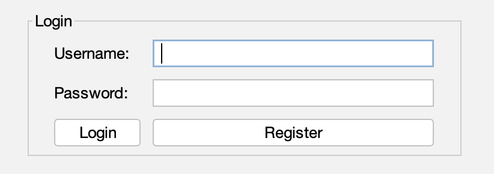

## 5. Ricerca Libri

### 5.1 Tipi di Ricerca Disponibili

#### Ricerca per Titolo
- Selezionare "Titolo" dal menu a tendina
- Inserire il titolo completo o parziale del libro
- Cliccare "Cerca"

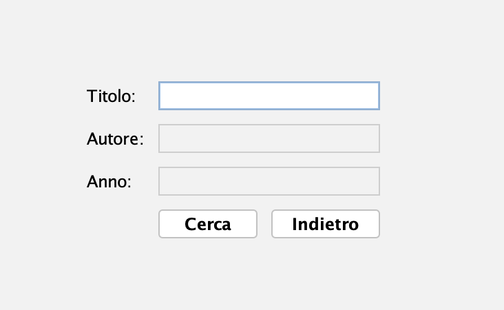

#### Ricerca per Autore
- Selezionare "Autore" dal menu a tendina
- Inserire il nome dell'autore
- Cliccare "Cerca"

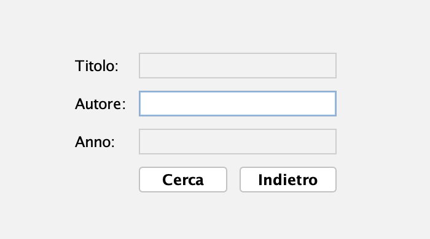

#### Ricerca per Autore e Anno
- Selezionare "Autore e Anno"
- Inserire l'autore
- Inserire l'anno di pubblicazione
- Cliccare "Cerca"

### 5.2 Filtri Avanzati
- Cercare nella propria libreria: Selezionare una libreria personale per cercare solo tra i propri libri
- Ricerca globale: Lasciare il campo libreria vuoto per cercare in tutto il catalogo

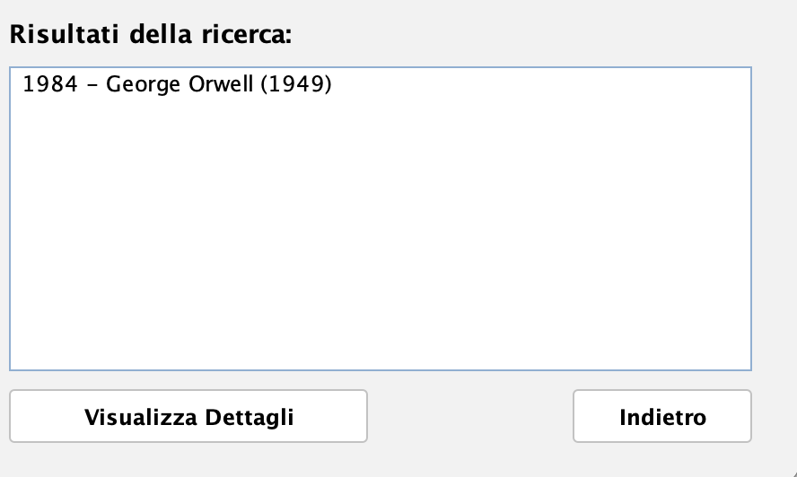

## 6. Gestione Librerie

### 6.1 Creare una Nuova Libreria
1. Andare nella sezione "Le Mie Librerie"
2. Cliccare "Nuova Libreria"
3. Inserire un nome descrittivo (es: "Fantasy", "Libri Letti 2024")
4. Selezionare i libri da aggiungere
5. Cliccare "Salva Libreria"

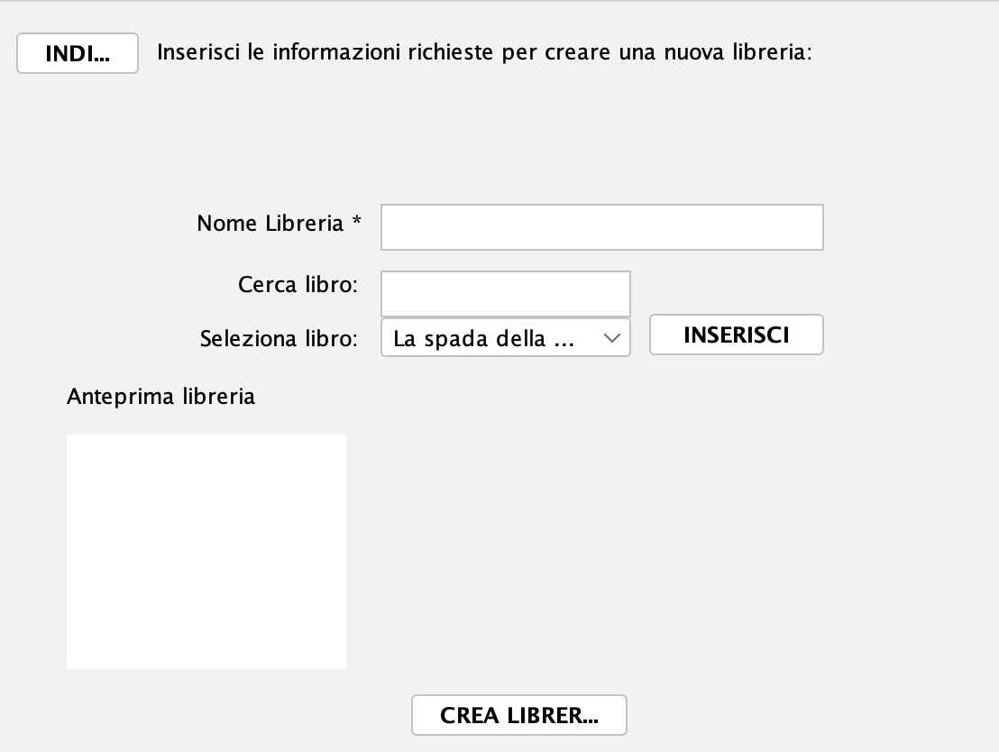

### 6.2 Gestire Librerie Esistenti
- Visualizzare contenuto: Cliccare sul nome della libreria
- Aggiungere libri: Usare il pulsante "+" nella schermata di dettaglio
- Rimuovere libri: Selezionare il libro e cliccare "Rimuovi"
- Eliminare libreria: Usare il pulsante "Elimina" (azione irreversibile)

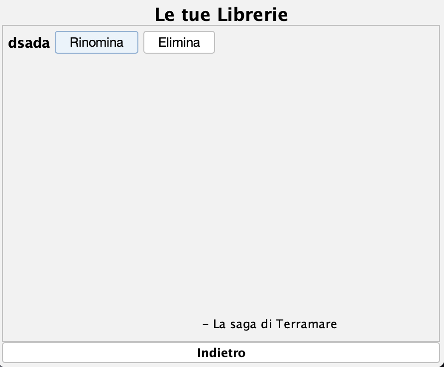

## 7. Valutazione Libri

### 7.1 Sistema di Valutazione
Ogni libro può essere valutato su 6 criteri:

1. Stile (1-5 stelle) - Qualità della scrittura
2. Contenuto (1-5 stelle) - Qualità della trama e dei contenuti
3. Piacevolezza (1-5 stelle) - Godibilità della lettura
4. Originalità (1-5 stelle) - Innovazione e unicità
5. Edizione (1-5 stelle) - Qualità editoriale e grafica
6. Voto Finale (1-5 stelle) - Giudizio complessivo

### 7.2 Aggiungere una Valutazione
1. Trovare il libro che si vuole valutare
2. Cliccare sul pulsante "Valuta questo libro"
3. Assegnare i voti per ogni criterio (1-5 stelle)
4. Aggiungere commenti opzionali per ogni categoria
5. Cliccare "Salva Valutazione"

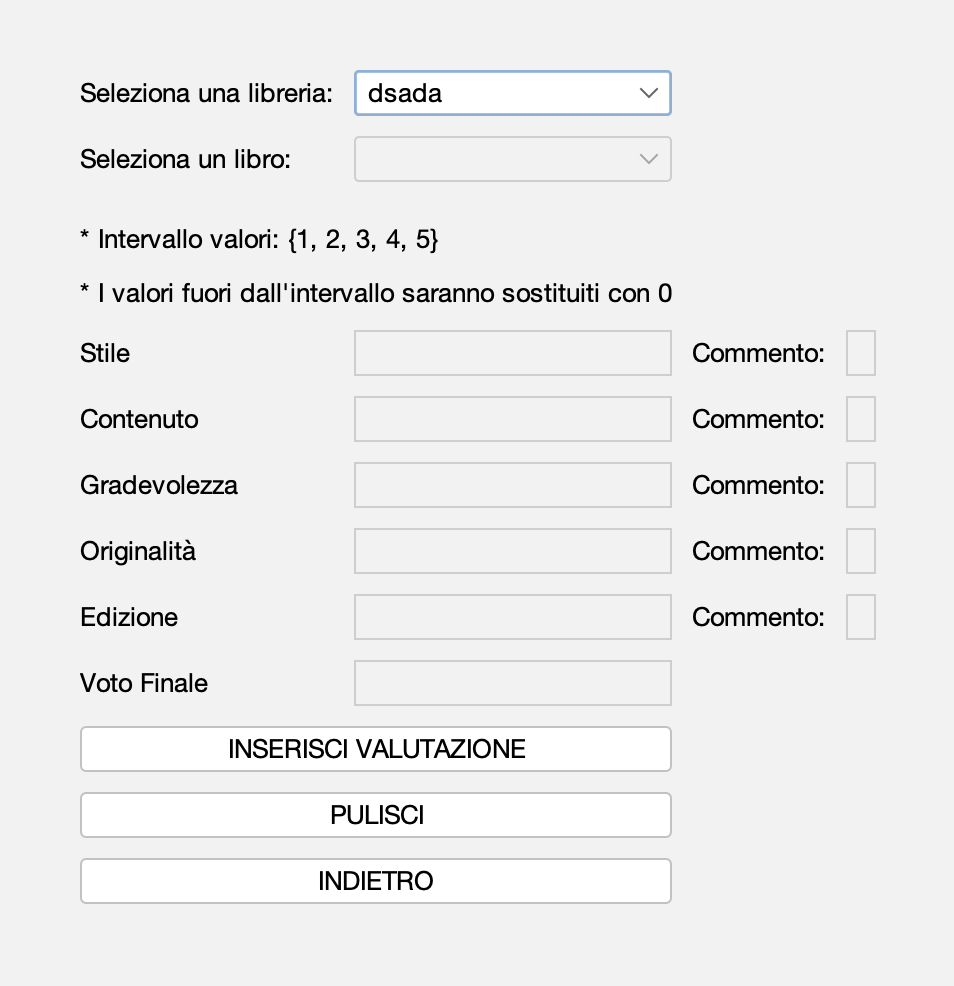

### 7.3 Commenti Specifici
È possibile aggiungere commenti dettagliati per ogni criterio:
- Commento Stile: "Scrittura fluida e descrittiva"
- Commento Contenuto: "Trama avvincente con colpi di scena"

## 8. Sistema di Suggerimenti

### 8.1 Come Funziona
Il sistema analizza le valutazioni personali e quelle della community per suggerire libri simili a quelli apprezzati.

### 8.2 Visualizzare Suggerimenti
1. Andare nella pagina di dettaglio di un libro
2. Scorrere fino alla sezione "Altri utenti suggeriscono"
3. Visualizzare i libri consigliati con il numero di suggerimenti

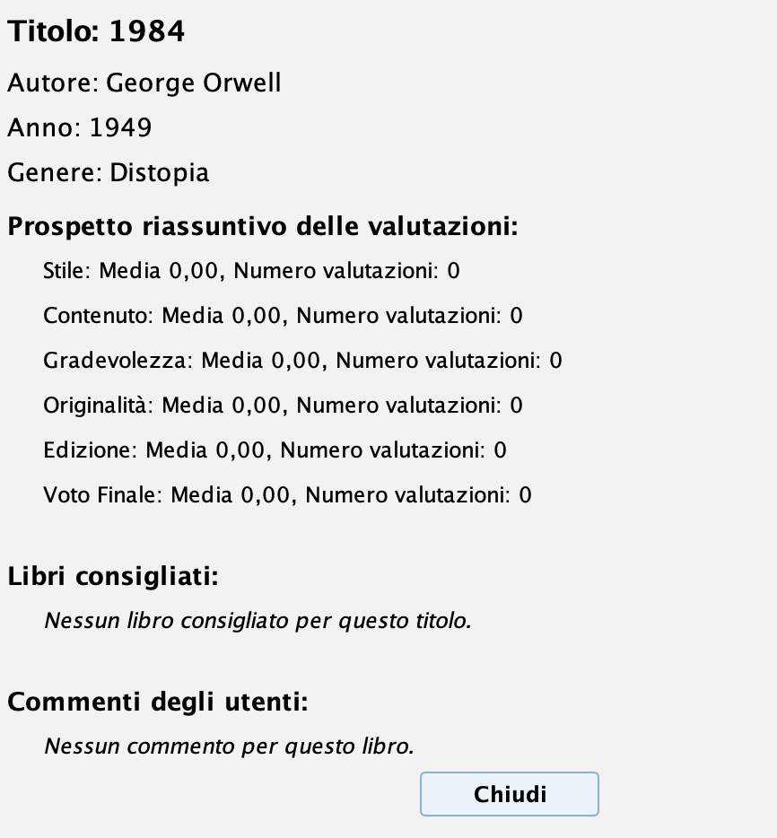

### 8.3 Aggiungere un Suggerimento
1. Se si sono trovati libri simili che potrebbero piacere ad altri lettori
2. Nella pagina del libro, cliccare "Suggerisci libri correlati"
3. Selezionare dalla lista i libri da suggerire
4. Cliccare "Conferma Suggerimenti"

## 9. FAQ e Risoluzione Problemi

### Domande Frequenti

**Come posso recuperare la password?**
Contattare l'amministratore di sistema all'indirizzo email di supporto.

**Perché non vedo tutti i libri nel catalogo?**
Il catalogo viene aggiornato periodicamente. Se si cerca un libro specifico che non si trova, contattare il supporto.

**Quante librerie posso creare?**
Non c'è un limite al numero di librerie che si possono creare.

**Posso condividere le mie librerie con altri utenti?**
Attualmente le librerie sono personali e private.

### Problemi Tecnici

**Problema: Non riesco ad accedere**
Soluzione: Verificare di inserire correttamente user ID e password. Controllare che il caps lock sia disattivato.

**Problema: La ricerca non restituisce risultati**
Soluzione: Provare a usare termini di ricerca più generici o verificare la connessione internet.

**Problema: La valutazione non viene salvata**
Soluzione: Assicurarsi di aver compilato tutti i campi obbligatori e di aver cliccato "Salva Valutazione".

### Supporto Tecnico

Per problemi tecnici o suggerimenti:
- Email: support@bookrecommender.com
- Telefono: +39 02 1234567
- Orari: Lun-Ven 9:00-18:00
- Corso: Laboratorio Interdisciplinare B - Università dell'Insubria

---

Buona lettura e buona esplorazione del mondo dei libri!

**Autori:** Matteo Mantica (Mat. 758070, VA), Leonardo Lambruschi (Mat. 753579, VA)  
**Versione:** 1.0.0  
**Ultimo aggiornamento:** Gennaio 2026